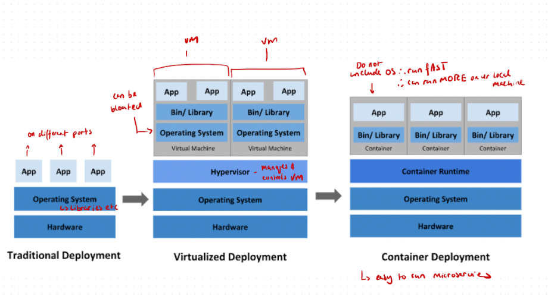
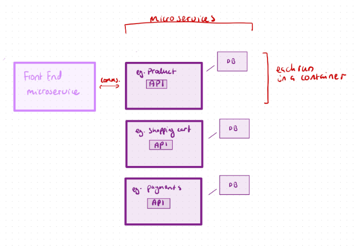
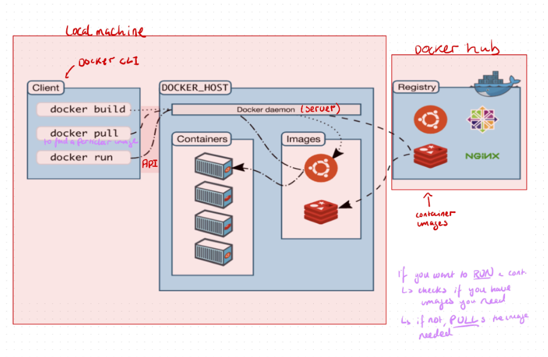

# Table of contents
- [Table of contents](#table-of-contents)
- [Task: Research microservices, containers and Docker](#task-research-microservices-containers-and-docker)
  - [Differences between virtualisation and containerisation](#differences-between-virtualisation-and-containerisation)
    - [What is usually included in a container vs virtual machine?](#what-is-usually-included-in-a-container-vs-virtual-machine)
    - [Benefits of each, especially a virtual machine over the traditional architecture](#benefits-of-each-especially-a-virtual-machine-over-the-traditional-architecture)
      - [Benefits of Virtual Machines](#benefits-of-virtual-machines)
      - [Benefits of Containers](#benefits-of-containers)
  - [Microservices](#microservices)
    - [What are they?](#what-are-they)
    - [How are they made possible?](#how-are-they-made-possible)
    - [Benefits of Microservices](#benefits-of-microservices)
  - [Docker](#docker)
    - [What is it](#what-is-it)
    - [Alternatives](#alternatives)
    - [How it works (Docker architecture/API)](#how-it-works-docker-architectureapi)
    - [Success story using Docker](#success-story-using-docker)
- [Task: Research Docker Compose](#task-research-docker-compose)

# Task: Research microservices, containers and Docker


## Differences between virtualisation and containerisation


Virtualization creates multiple OS environments on a single machine using VMs.
<br> 
Containerization runs lightweight, isolated apps that share the host OS, making it more efficient for scalable and portable applications.

### What is usually included in a container vs virtual machine?

In a **container**, only the application, its dependencies, and libraries needed to run it are included, while it shares the host OS kernel with other containers running on the same machine. Containers don’t need their own kernel making them lightweight. 

**A host OS kernel** is the core part of an operating system that manages the system’s resources, such as CPU, memory, and hardware devices.

 <br>

In a **virtual machine (VM)**, a full guest operating system, applications, dependencies, and libraries are included, creating a complete OS environment isolated from other VMs.

### Benefits of each, especially a virtual machine over the traditional architecture

Here are the benefits of virtual machines (VMs) over traditional architecture, as well as the unique advantages of both VMs and containers:

#### Benefits of Virtual Machines 

1. **Resource Efficiency**: VMs allow multiple operating systems to run on a single physical server, maximizing hardware utilization and reducing the need for more physical servers.
2. **Isolation**: Each VM runs in a fully isolated environment, making it secure and preventing conflicts between applications.
3. **Scalability and Flexibility**: VMs can be easily cloned, moved, or scaled up and down, enabling faster deployment and adaptability to varying workloads.
4. **Disaster Recovery and Backup**: VMs can be easily backed up, restored, or migrated, improving disaster recovery options compared to traditional single OS environments on physical hardware.
5. **Support for Multiple OSes**: With VMs, you can run different operating systems on the same hardware, allowing diverse applications and development environments.

#### Benefits of Containers

1. **Lightweight and Fast**: Containers only contain the application and its dependencies, sharing the host OS kernel, which makes them lightweight and quick to start.
2. **High Density and Efficiency**: Containers use fewer resources and can run in higher densities on the same hardware compared to VMs, leading to cost savings.
3. **Consistency Across Environments**: Containers ensure that applications run the same way across development, testing, and production, supporting continuous integration and delivery (CI/CD).
4. **Portability**: Containers are highly portable and can run consistently across different environments and cloud platforms, simplifying deployment and scaling.


## Microservices
### What are they?
Microservices are a software architectural style where an application is built as a collection of small, independent services, each responsible for a specific function or feature.
<br>
Each microservice runs as a separate process and communicates with other services through lightweight APIs 



1. **Independently Deployable**: Each microservice can be developed, deployed, and scaled independently without affecting others, allowing for faster updates and more flexibility.
2. **Single Responsibility**: Each microservice is responsible for a specific business function, which helps keep the codebase modular and easier to manage.
3. **Technology Agnostic**: Different services can be built using different technologies or programming languages based on specific needs, as long as they communicate through standardized interfaces.
4. **Scalable**: Individual microservices can be scaled independently to handle demand, making the application more efficient in resource usage.

### How are they made possible?

Microservices are made possible by several key technologies and practices that enable independent, modular, and scalable application design:

1. **Containerization (e.g., Docker)** Containers allow each microservice to run in its own isolated environment with the required dependencies. This makes it easier to deploy, scale, and manage services independently while ensuring consistency across different environments.

2. **Service-Oriented Architecture (SOA) Principles** Microservices extend the principles of SOA by making each service more lightweight and focused on single, well-defined business functions. This modularity enables easier updates, independent scaling, and better maintainability.

3. **APIs for Communication (REST, gRPC, GraphQL)** APIs, especially RESTful APIs, enable different microservices to communicate in a standardized, language-agnostic way. These lightweight communication protocols make it easier for services to exchange data and interoperate regardless of language or framework.

4. **Orchestration and Management Tools (e.g., Kubernetes)** Orchestration tools like Kubernetes help manage and automate the deployment, scaling, and operation of microservices across a cluster of servers. These tools monitor services, balance loads, and ensure resilience, making it easier to manage complex microservices architectures.

5. **DevOps and CI/CD Practices** Continuous Integration and Continuous Delivery (CI/CD) pipelines allow microservices to be developed, tested, and deployed independently. Automated testing and deployment pipelines help quickly push updates to specific services without disrupting the entire system.

6. **Decentralized Data Management** Microservices often have decentralized data storage, where each service manages its own database or data store. This autonomy reduces dependencies between services and enables scaling based on specific needs, although it also requires careful data consistency management.

7. **Event-Driven Architecture and Messaging Systems (e.g., Kafka, RabbitMQ)** Messaging systems enable microservices to communicate asynchronously, allowing services to be more resilient and loosely coupled. Event-driven architecture lets services react to changes in the system without direct dependencies on each other, enhancing scalability and fault tolerance.

8. **Cloud Infrastructure**
Cloud platforms offer on-demand resources, making it easy to scale individual microservices according to demand. They provide infrastructure-as-a-service (IaaS) and platform-as-a-service (PaaS) options, allowing organizations to quickly deploy, scale, and manage microservices across distributed environments.


### Benefits of Microservices

- **Flexibility and Speed**: Teams can work on and deploy services independently, accelerating development cycles and enabling continuous delivery.
- **Resilience**: If one microservice fails, it doesn’t necessarily bring down the entire application; other services can continue operating.
- **Easier Scaling**: Services can be scaled independently based on specific needs, optimizing resource usage.


## Docker
### What is it
Docker is an open-source platform that enables developers to automate the deployment, scaling, and management of applications within lightweight, portable containers.

### Alternatives
1. Podman
2. Kubernetes
3. rkt
4. Linux Containers (LXC)
5.  OpenShift
6. Amazon ECS (Elastic Container Service)

### How it works (Docker architecture/API)

Docker works by packaging applications into isolated containers that include everything needed to run them. It relies on the Docker daemon to manage containers, utilizes a client for user commands, and employs the host OS kernel to ensure efficient resource use and isolation. 

**Docker Architecture**:
- Docker Daemon: The Docker daemon (dockerd) is a background process that manages Docker containers. It handles requests from the Docker client and can communicate with other Docker daemons.
- Docker Client: The command-line interface (CLI) that allows users to interact with the Docker daemon using commands (e.g., docker run, docker build).
- Docker Registry: A storage and distribution system for Docker images. Docker Hub is the default public registry, but private registries can also be used.





### Success story using Docker

**Spotify's Success with Docker**

Microservices Complexity: Spotify transitioned from a monolithic architecture to a microservices architecture to enhance scalability and agility. This shift introduced complexities in managing hundreds of services and their dependencies.
<br>
Environment Consistency: Spotify needed a way to ensure consistency across different development, testing, and production environments to avoid issues related to “it works on my machine” syndrome.
<br>

**Implementation of Docker**
<br>
Containerization: Spotify adopted Docker to containerize its microservices, allowing each service to be packaged with its dependencies and configuration. This approach simplified deployment and improved reliability.
<br>
Development Workflow: Developers could use Docker to create consistent local development environments that mirrored production, ensuring that applications ran the same way across various stages of the pipeline.
<br>
CI/CD Pipeline: Docker was integrated into Spotify's Continuous Integration and Continuous Deployment (CI/CD) workflows. This integration enabled rapid testing and deployment of microservices, significantly reducing the time to ship new features.

# Task: Research Docker Compose
**Why use it?:**
Docker compose is used to run multi-container docker applications in a configuration file "docker-compose.yaml"

**How to use it:**
You need to install docker compose and create a docker compose yaml file.

**What do you need to install for it to work?:**
- Docker engine (Docker desktop)
- Docker compose

**How to store your docker compose file?:**
The docker compose file should be set in the root directory of the project repo.

**Find out about these docker compose commands to:**
- manage your application:
  - start the application (without detached mode) ```docker-compose up```
  - start the application (in detached mode) ```docker-compose up -d```

**what is the difference between running your application with or without detached mode:**
"-d" runs the container in the background (this is detached mode") so the logs won't run in the foreground and control will return to the cmd line

**stop the application:**
```docker-compose down```

**run your application in detached mode:**
```docker-compose up -d```

**check services running with docker compose**
```docker-compose ps```

**view logs in real-time**
```docker-compose logs -f```

**view docker compose images**
```docker-compose images```

