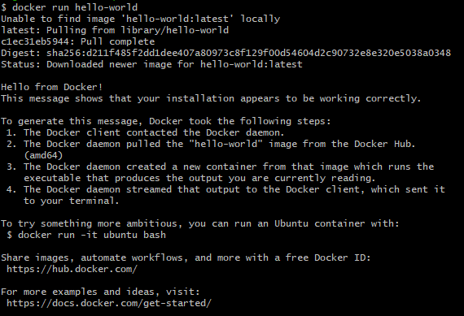
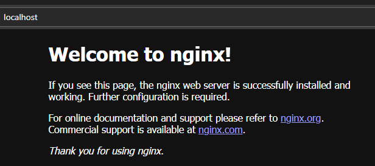
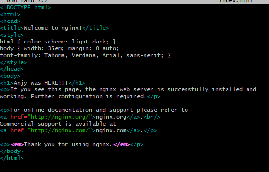
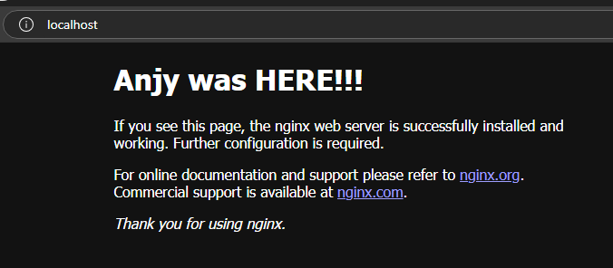
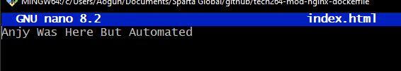
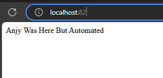
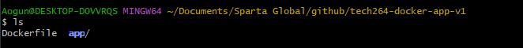
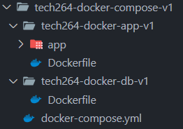

- [commands](#commands)
- [Docker compose commands](#docker-compose-commands)
- [Run a test container](#run-a-test-container)
  - [Run an NGINX container](#run-an-nginx-container)
  - [Run an container on a different port](#run-an-container-on-a-different-port)
- [Run commands inside our container](#run-commands-inside-our-container)
  - [install sudo](#install-sudo)
  - [Change the front page of nginx x](#change-the-front-page-of-nginx-x)
- [Push host-custom-static-webpage container image to Docker Hub](#push-host-custom-static-webpage-container-image-to-docker-hub)
  - [Create an image from your running container](#create-an-image-from-your-running-container)
  - [Push the image to your Docker Hub account](#push-the-image-to-your-docker-hub-account)
  - [Once you know your image runs from pulling down from Docker Hub](#once-you-know-your-image-runs-from-pulling-down-from-docker-hub)
- [Automate docker image creation using a Dockerfile](#automate-docker-image-creation-using-a-dockerfile)
- [Run the NodeJS Sparta test app in a containers](#run-the-nodejs-sparta-test-app-in-a-containers)
- [Run both the front and post page using docker compose](#run-both-the-front-and-post-page-using-docker-compose)

**DOCKER**

# commands 

- ```docker --help``` to get help
- ``` docker ps``` to see containers running
- ``` docker stop *ID or name *``` to stop the container running 
- ```docker ps -a``` to see all containers - running or no
- ```docker start *container name/ID*``` to start up a container you've already run
- ``` docker rm *name of the container/ID*``` to remove a container (not the image)
-```docker rm -f *container name/ID*``` to force a running container to stop and remove it 
-```docker stop $(docker ps -a -q)``` stop all docker containers
- ```docker rmi *container name```

# Docker compose commands
- ```docker-compose ps``` lists all the containers running
- ```docker-compose up --build``` builds images before starting containers, useful if you made changes to your Dockerfile
-  ```docker-compose up``` start the application (without detached mode)
-  ```docker-compose up -d``` start the application (in detached mode)
-  ```docker-compose down``` stop the application
- ```docker-compose up -d``` run your application in detached mode
- ```docker-compose ps``` check services running with docker compose
- ```docker-compose logs -f``` view logs in real-time "-f" follows the logs in real time, you can add the name of the container after to view a specific one
- ```docker-compose images``` view docker compose images

# Run a test container
**may need to run as admin on bash & docker**

- use ```docker images``` to see the images you have 
- test run ``` docker run hello-world```
- it will pull from library and downloads an image and run the container


## Run an NGINX container

``` docker run -d -p 80:80 nginx:latest```

- "-d" detached mode - runs in the background
- "-p 80:80" nginx runs on port 80, the first 80 is the first port (the port it'll run outside of the container) and the second port (the port it'll run on inside the container) is after the colon. 
- "nginx:latest" specify the tag and therefore the version you want it to pull, if there is no tag it will download the lasts

- to check go to "127.0.0.1" or "localhost" on your web browser and nginx should be running



## Run an container on a different port 
- ```docker run -d -p 80:80 ahskhan/nginx-254``` if you run it - there will be an error as nginx is already running on port 80
- ```docker run -d -p 90:80 ahskhan/nginx-254``` it will now be running on port 90


# Run commands inside our container

``` docker exec -it *container id* sh```

- "exec" to execute commands 
- "-it" interact so we cna use it 
- "t" we want it running in a terminal in our container
- "sh" we are sunning s shell command 

**THIS WILL BRING A ERROR`**

- we need to set an alias
  - set one for terraform
  - ```alias tf="terraform"``` 
  - when you type "tf" it now runs the "terraform" cmd
  - this only lasts for the bash session!
- set one for the error to add winpty to the beginning of the cmd
  ```alias docker="winpty docker"``` 

## install sudo
It is a very cut down version of linux - sudo doesn't exist
- ```uname -a``` shows the name 
- ```apt-get update```
- ```apt-get upgrade```
- ```apt-get install sudo``` 

## Change the front page of nginx x
- use this path to cd to the html file  ```/usr/share/nginx/html```
- ``` apt-get install nano``` doesn't have nano -  download it 
- ```nano index.html``` nano into the html file



- CTRL + S and CTRL + X



- ```exit``` to leave the container

# Push host-custom-static-webpage container image to Docker Hub

## Create an image from your running container 

1. Login into your docker hub ```docker login```
2. use the command ```docker commit <container_id> <new_image_name>```
3. for this instance ```docker commit blissful_burnell```
4. you can name it later using  ```docker tag <existing_image_id> <username>/<image_name>:<tag>```

## Push the image to your Docker Hub account
use the cmd ```docker push *username*/*my_new_image*:latest```

## Once you know your image runs from pulling down from Docker Hub

```docker run -d -p 81:80 nao55/nginx-new-image:v1```

# Automate docker image creation using a Dockerfile

1. Create a new folder such as tech2xx-mod-nginx-dockerfile (not in a repo that will be published)
2. cd into the new folder on bash
3. Create an index.html you'd like to use instead of the nginx default page and nano into it and write in it



1. Create a docker file ```touch Dockerfile```
2. add a script 
```
# added maintainer label to specify who created the file

LABEL maintainer="Anjy anjyogunwoolu@gmail.com"

# use custom image- the nginx or
FROM nginx:latest

# copy the html file to the default nginx location

COPY index.html /usr/share/nginx/html/*index.html* 

#if the file is the same name then you don't need to include a new name

# add the EXPOSE cmd to inform docker it should listen on a specific port - this is just meta data for good practice

EXPOSE 80

```
3. check the container exists
4. run the cmd ```docker build -t nao55/my-nginx-image . ```
   1. "-t" means the image is being tagged with the name that follows
   2. "." specifies that the build should be run in the current directory
   3. "nao55" is the username so it can be pushed rather than just exist locally 
5. push the container ```docker push nao55/nginx-automated-image```
6. Run the container ```docker run -d -p 82:80 nao55/nginx-automated-image```



# Run the NodeJS Sparta test app in a containers

1. create a repo to keep your app and Dockerfile for your container "tech264-docker-app-v1"
2. copy the app folder to this repo
3. create a Dockerfile in this repo to write your commands 



1. Within the Dockerfile:
   1. the base image should be a nodejs v20 image ```FROM node:20-alpine3.20``` the "-alpine3.20" is a reduced version of the nodejs v20 at 270mb rather than 1.6gb
   2. label yourself as the maintainer ```LABEL maintainer="Anjy Anjyogunwoolu@gmail.com"```
   3. set the working directory that you want the cmds to work in ```WORKDIR /usr/src/app```
   4. copy the app file in your repo to the working directory in the container and copy the json packages as well (This is done separately from copying the rest of the app code to help with Docker layer caching, speeding up builds if your dependencies haven't changed.) ```COPY app .``` ```COPY package*.json ./```
   5. install the npm dependencies so the app can run ```RUN npm install```
   6. expose the port you want docker to run the app on ```EXPOSE 3000```
   7. use CMD to start the app ```CMD ["npm", "start"]```

   ```

   # nodejs v20 as the base image
   FROM node:20

   #label maintainer
   LABEL maintainer="Anjy Anjyogunwoolu@gmail.com"

   # set the default working directory to /usr/src/app
   WORKDIR /usr/src/app

   # COPY app and both the package.json and the package-lock.js to wo>
   COPY app .
   COPY package*.json ./


   # install dependencies with npm
   RUN npm install

   # expose port
   EXPOSE 3000

   # CMD to start the app
   CMD ["npm", "start"]
   ```
8. save and exit your docker file
9.  run a docker build ```docker build -t nao55/sparta-app-npm-run .```
10. do a docker push (add a tag for reference)```docker push nao55/sparta-app-npm-run:v1```
11. do a docker run to run your container ```docker run -d -p 3000:3000 nao55/sparta-app-npm-run:v1``` we are running in port 3000 so include that
12. check "localhost:3000" to see if your page is working

# Run both the front and post page using docker compose
1. Create a repo the store your docker compose yaml file and the repos for your db and app



1. create your app dockerfile in the same repo as your app data
[app docker repo](../../tech264-docker-compose-v1/tech264-docker-app-v1)

1. the db does not need a dockerfile as it is just an image that we are using, so this can be put in the db part of the compose yaml
```
db:
  image: mongo:7.0.6
  container_name: mongo_db
  ports:
    - "27017:27017" 
    volumes:
    - mongodb_data:/data/db
```
1. I did create one but it is unnecessary [db docker repo](../../tech264-docker-compose-v1/tech264-docker-db-v1)
2. create a docker-compose.yml in the parent repo 

```
# indicate that you'd like to run service
services:
  db: #the name of the container for your db
    image: nao55/tech264-docker-db-v1:latest  #the image you will be using (can use the script written at point 3)
    ports:  # mongo db runs at port 27017
    - "27017:27017" 
    volumes:
    - mongodb_data:/data/db #used to make the the data persistent by creating a reference to the repo it stores it in


  app:
    image: nao55/sparta-app-npm-run:latest
    depends_on:
    - db   #the db service is needs to run first before the app service
    ports:
    - "3000:3000"
    environment:
      DB_HOST: "mongodb://db:27017/posts" # sets the env. var. to allow the app container to reference the db
    command: sh -c "node seeds/seed.js && npm start" # a shell command to run in the app script and start the app

volumes:
  mongodb_data: {}

```
2. use this command to run the nodejs seeds commands manually ```docker exec -it tech264-docker-compose-v1-app-1 node seeds/seed.js```
3. use this command to build and start the docker-compose file detached ```docker-compose up --build -d```
4. check "localhost:3000/posts"
5. the page should be working and seeded


