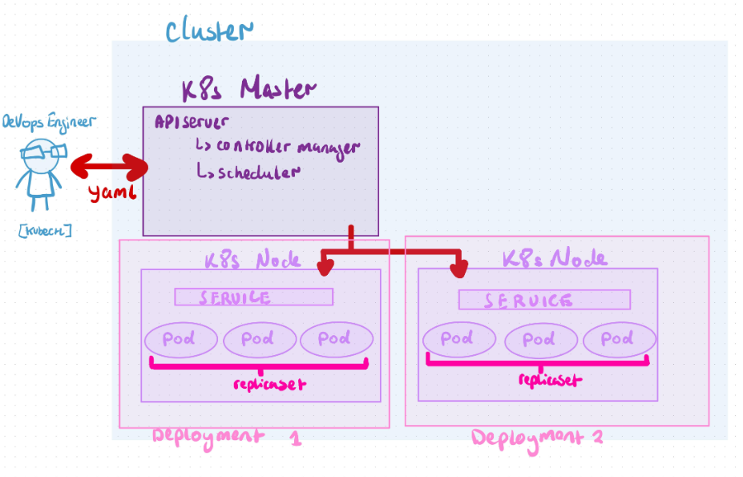
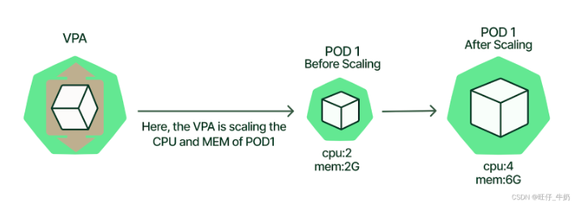
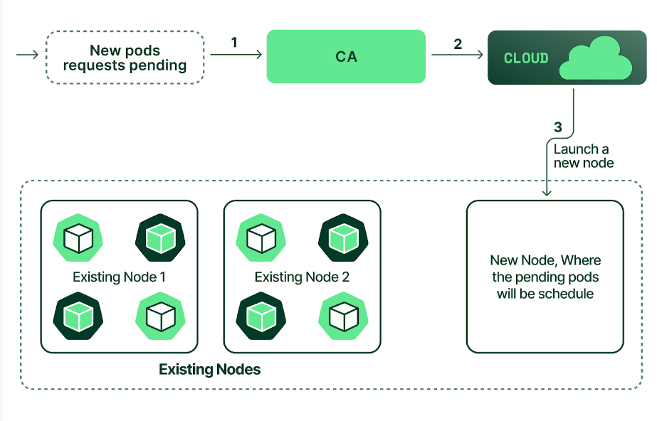
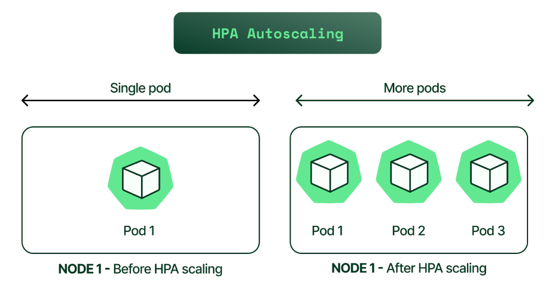

# Table of contents 
- [Table of contents](#table-of-contents)
- [What is Kubernetes](#what-is-kubernetes)
- [Why is Kubernetes needed](#why-is-kubernetes-needed)
- [Benefits of Kubernetes](#benefits-of-kubernetes)
- [Use cases](#use-cases)
- [Success stories](#success-stories)
- [Kubernetes architecture (include a diagram)](#kubernetes-architecture-include-a-diagram)
- [The cluster setup](#the-cluster-setup)
  - [What is a cluster](#what-is-a-cluster)
  - [Master vs worker nodes](#master-vs-worker-nodes)
    - [Master Node (works on the Control Plane)](#master-node-works-on-the-control-plane)
      - [Responsibilities of the Master Node:](#responsibilities-of-the-master-node)
    - [Worker Nodes](#worker-nodes)
      - [Responsibilities of Worker Nodes (or just nodes work on the data plane):](#responsibilities-of-worker-nodes-or-just-nodes-work-on-the-data-plane)
  - [Pros and cons of using managed service vs launching your own](#pros-and-cons-of-using-managed-service-vs-launching-your-own)
    - [Managed Kubernetes Service - managed by cloud services (eg. GKE, EKS, AKS)](#managed-kubernetes-service---managed-by-cloud-services-eg-gke-eks-aks)
    - [Self-Managed Kubernetes](#self-managed-kubernetes)
  - [Control plane vs data plane](#control-plane-vs-data-plane)
    - [Control Plane](#control-plane)
    - [Data Plane](#data-plane)
- [Kubernetes objects](#kubernetes-objects)
  - [Research the most common ones, e.g. Deployments, ReplicaSets, Pods](#research-the-most-common-ones-eg-deployments-replicasets-pods)
  - [What does it mean a pod is "ephemeral"](#what-does-it-mean-a-pod-is-ephemeral)
- [How to mitigate security concerns with containers](#how-to-mitigate-security-concerns-with-containers)
- [Maintained images](#maintained-images)
  - [What are they](#what-are-they)
  - [Pros and cons of using maintained images for your base container images](#pros-and-cons-of-using-maintained-images-for-your-base-container-images)
    - [Pros of Using Maintained Images](#pros-of-using-maintained-images)
    - [Cons of Using Maintained Images](#cons-of-using-maintained-images)
- [Research types of autoscaling with K8s](#research-types-of-autoscaling-with-k8s)
- [Upcoming Assessment Topics](#upcoming-assessment-topics)
  - [What are the implecations of a pod being ephemeral?](#what-are-the-implecations-of-a-pod-being-ephemeral)
  - [What is a maintained image and why should we use them?](#what-is-a-maintained-image-and-why-should-we-use-them)
  - [What's the difference between DevOps, SRE and platform Engineering?](#whats-the-difference-between-devops-sre-and-platform-engineering)
    - [Table of Differences](#table-of-differences)
  - [How Secure are Kubernetes Secrets?](#how-secure-are-kubernetes-secrets)
  - [What are the biggest challenges facing enterprises?](#what-are-the-biggest-challenges-facing-enterprises)
  - [How do these organisations handle Kubernetes?](#how-do-these-organisations-handle-kubernetes)
  - [Why/when would a business NOT want to use a microservices architecture?](#whywhen-would-a-business-not-want-to-use-a-microservices-architecture)

# What is Kubernetes

Kubernetes is an open-source platform for automating the deployment, scaling, and management of containerized applications.

# Why is Kubernetes needed
Kubernetes is needed primarily for orchestrating and managing containerized applications across clusters of machines, especially in complex environments.

# Benefits of Kubernetes
- Automated Scaling: Scales applications up/down based on demand, optimizing resource use.
- Self-Healing: Automatically restarts or reschedules failed containers, ensuring reliability.
- Simplified Deployments: Automates deployment, updates, and rollbacks, reducing downtime.
- Load Balancing: Distributes traffic across containers, maintaining performance.
- Multi-Cloud Compatibility: Runs consistently across cloud providers and on-premises.
- Environment Consistency: Ensures applications run uniformly from development to production.
- Microservices Management: Manages independent services, ideal for distributed architectures.
- Benefit vs a monolith: no single point of failure

# Use cases 
Large e-commerce site with different services (like product catalog, payment processing, and user authentication) each running as microservices in separate containers managed by Kubernetes/

# Success stories
**Pinterest**
Challenge: Pinterest experiences extreme traffic spikes, especially during events like holidays, requiring flexible scaling.
 
Solution: Kubernetes allowed Pinterest to dynamically scale services up and down in response to user demand, optimizing resource costs and enhancing user experience during peak times.
 

**Airbnb**
Challenge: With a complex microservices architecture, Airbnb needed to scale services efficiently, manage rapid deployments, and reduce system downtime.
 
Solution: Kubernetes enabled Airbnb to automate scaling and load balancing, and improve the speed of deployments. This streamlined resource usage and allowed the team to innovate faster.

# Kubernetes architecture (include a diagram)

# The cluster setup
## What is a cluster

- A collection of connected computers (often called nodes) that work together to function as a single, cohesive system.
- Nodes share resources, distribute workloads, and allow applications to run across multiple machines.
- A pod contains one or more containers
- Containers within a Pod work together as a single application or a single part of a larger application

## Master vs worker nodes

### Master Node (works on the Control Plane)
The master node, or control plane, is responsible for managing the overall state and coordination of the cluster.For redundancy an minimum of 3 master nodes are required of not using a kubernetes service. 

#### Responsibilities of the Master Node:
- **Orchestration**: Oversees the scheduling of pods and workloads.
- **State Management**: Ensures that the cluster’s desired state matches the actual state (self-healing).
- **Monitoring and Maintenance**: Monitors node and application health, initiating action if issues arise.
- **Scaling and Updates**: Manages scaling (adding/removing pods) and rolling updates.

### Worker Nodes
Worker nodes run the actual applications within containers. Each worker node is responsible for running and managing the lifecycle of the containers assigned to it. 

#### Responsibilities of Worker Nodes (or just nodes work on the data plane):
- **Run Application Workloads**: Hosts the pods, which contain containers running applications.
- **Resource Management**: Manages CPU, memory, and storage for the pods on the node.
- **Networking**: Facilitates communication within and outside the cluster using the kube-proxy component.

## Pros and cons of using managed service vs launching your own

### Managed Kubernetes Service - managed by cloud services (eg. GKE, EKS, AKS)

**Pros**:
- **Easy Setup & Maintenance**: Quick to set up with automated updates and security. The service manages the master node for you
- **Reliability**: High availability and integration with cloud services.
- **Scalability**: Simplified auto-scaling and resource management.

**Cons**:
- **Less Customizable**: Limited access to low-level configurations.
- **Potentially Higher Costs**: May cost more than self-managed setups.
- **Vendor Lock-In**: Dependence on a single cloud provider.

### Self-Managed Kubernetes

**Pros**:
- **Full Control**: Complete customization and flexibility.
- **Lower Cost Potential**: Can be more cost-effective at scale.
- **Infrastructure Flexibility**: Suitable for on-premises, hybrid, or multi-cloud environments.

**Cons**:
- **Higher Maintenance**: Requires significant expertise and ongoing management.
- **Security Burden**: Security patches and updates are the organization’s responsibility.
- **Reliability Challenges**: Ensuring high availability is more complex.

## Control plane vs data plane

In Kubernetes (and networking), the **control plane** and **data plane** are two distinct components that play different roles:

### Control Plane
- **Purpose**: Manages and orchestrates the cluster, maintaining the overall state of applications and resources.

### Data Plane
- **Purpose: Executes and runs application workloads.
- 
# Kubernetes objects

## Research the most common ones, e.g. Deployments, ReplicaSets, Pods

In Kubernetes, several core objects are used to manage applications and their resources. Here are the most common Kubernetes objects:

1. **Pod**
-  The smallest and simplest Kubernetes object, a Pod represents a single instance of a running application. It can contain one or more containers that share storage, networking (internal IP address), and 

1. **Deployment**
- A Deployment manages a set of identical Pods, ensuring the specified number of replicas are running and managing updates to the application. It provides declarative updates to Pods. The replica set deals with pods.

1. **ReplicaSet**
-  Ensures that a specified number of Pod replicas are running at any given time. While often used indirectly through Deployments, ReplicaSets can also be used independently.

1. **Service**
-Exposes your application in a logical set of Pods. Services enable communication between different pods and provide load balancing.

1. **Namespace**
- A way to group resources within a Kubernetes cluster. Namespaces allow for organizing and managing resources effectively. 

1. **ConfigMap**
- Allows you to decouple configuration artifacts from image content to keep containerized applications portable. ConfigMaps store non-sensitive configuration data as key-value pairs.

1. **Secret**
Similar to ConfigMaps, but used for storing sensitive information such as passwords, tokens, or SSH keys, with additional encoding to protect the data. Encoded with base64 - can be converted to normal text.

1. **PersistentVolume (PV)**
- **PersistentVolume (PV)**: A way to store data in the cluster persistently.Provides durable storage that persists beyond the life of Pods.

1. **Job and CronJob**
- **Job**: A controller that creates one or more Pods and ensures that a specified number of them successfully terminate. Jobs are used for batch processing or one-off tasks.
- **CronJob**: Similar to Jobs but allows for running jobs on a scheduled basis (e.g., daily, weekly).
 

## What does it mean a pod is "ephemeral"
It means that the Pod is temporary and has a limited lifespan.
 
For example, a Pod might be created to handle a specific task and terminated once the task is completed.

# How to mitigate security concerns with containers

1. **Use Trusted/Maintained Images**: Start with official or trusted base images and regularly scan for vulnerabilities.
2. **Minimize Attack Surface**: Use minimal base images and remove unnecessary packages.
3. **Implement Least Privilege**: NEVER run containers as root and limit privileges.
4. **Network Security**: Isolate containers with network policies and control traffic with firewalls.
5. **Secure Registries**: Use private registries with authentication and enable image vulnerability scanning.
6. **Runtime Monitoring**: Utilize tools like Falco for real-time monitoring and logging of container activities.
7. **Configuration Management**: Enforce security configurations consistently with management tools.
8. **Secrets Management**: Use secure tools for managing sensitive information, avoiding hardcoding secrets.
9.  **Resource Limits**: Set CPU and memory limits to prevent denial-of-service attacks.
10. **Image Signing**: Sign images to ensure only verified images are deployed.

# Maintained images
## What are they
They are container images that are regularly updated, monitored, and supported by their maintainers. These images are essential for ensuring security, stability, and compatibility in containerized applications.

## Pros and cons of using maintained images for your base container images

### Pros of Using Maintained Images

1. **Security**:
   - Regular updates and patches address vulnerabilities, enhancing overall security.
   - Security scans help identify and mitigate known issues.

2. **Reliability**:
   - Maintained images are often tested and verified, reducing the likelihood of encountering bugs.
   - Consistent support ensures stability in production environments.

3. **Performance Improvements**:
   - Ongoing optimizations can lead to better performance and resource utilization.
   - Updates may include performance enhancements and feature upgrades.

4. **Version Control**:
   - Maintained images usually follow versioning practices, allowing easy tracking of changes and updates.
   - Users can choose specific versions based on compatibility and stability needs.

### Cons of Using Maintained Images

1. **Dependency on Maintainers**:
   - Reliance on third-party maintainers means users must trust their ability to keep the images updated.
   - If maintainers abandon a project, users may be left with outdated images.

2. **Potential for Breaking Changes**:
   - Regular updates may introduce breaking changes or incompatibilities, requiring developers to adapt their applications.
   - Users need to monitor changes carefully and test updates before deployment.

3. **Resource Consumption**:
   - Frequent updates may require additional resources for testing and integration, especially in CI/CD pipelines.
   - Maintaining the latest versions might lead to increased image sizes if not managed properly.

4. **Limited Customization**:
   - Maintained images may not be as flexible as custom-built images, limiting the ability to tailor the base image to specific needs.
   - Users might need to add additional layers or configurations, potentially introducing complexity.

5. **Latency in Updates**:
   - Sometimes, there might be a delay between discovering a vulnerability and releasing a patch, leaving users exposed in the interim.
   - Users need to actively monitor for updates and apply them promptly.

# Research types of autoscaling with K8s

**Horizontal Pod Autoscaling (HPA)**

HPA automatically adjusts the number of pods in deployment to withstand load (CPU, memory or whatever chosen metric)

**Vertical Pod Autoscaling (VPA)**

VPA adjusts the resource allocations within the pod (ie CPU and memory) to withstand the load.

**Cluster Autoscaling**

CA is normally used by managed k8s services (GKE, EKS, AKS) or by downloading cluster autoscaler for self managed. It increases the number of nodes in a cluster to withstand the load.

# Upcoming Assessment Topics
## What are the implecations of a pod being ephemeral?
* persistent volumess can solve the issue of losing data.
 
## What is a maintained image and why should we use them?
* It's a container image originated from trusted sources, like docker.
* They have regular updates, better security (receive regular security patches and updates).
 
## What's the difference between DevOps, SRE and platform Engineering?
**DevOps**
* Focuses on collaboration between development and operations.
* Delivering code quicker to end users.
* Help the developers to be able to deliver their code faster for the end users so it can create value for the business.
  * Make a developers life easier.
* Provide consistent environments for the developers to use.
 
**SRE** (Site Reliability Engineering)
* Focuses on reliability and uptime of services: aka, anything they need to do to keep things up and running.
* Makes sure that the changes that are applied don't break the infrastructure so the application is always available.
  * They want the highest up-time possible.
 
**Platform Engineering**
* Building and maintaining internal platforms.
* Focuses on creating and managing the infrastructure that supports development teams.
* Developing a platform/ecosystem where developers can access the tools and resources they need to perform their tasks efficiently.
 
 
 
### Table of Differences
 
| **Aspect**          | **DevOps**                                      | **SRE (Site Reliability Engineering)**                  | **Platform Engineering**                              |
|---------------------|-------------------------------------------------|--------------------------------------------------------|------------------------------------------------------|
| **Focus**           | Collaboration between development and operations | Reliability and uptime of services                      | Building and maintaining internal platforms           |
| **Key Activities**  | CI/CD, automation, monitoring, and collaboration | Monitoring, incident response, and automation           | Creating tools and infrastructure for developers      |
| **Goal**            | Faster and more reliable software delivery       | Ensuring services are reliable and scalable             | Improving developer productivity and efficiency       |
| **Approach**        | Cultural shift and practices                     | Applying software engineering to operations problems    | Providing reusable components and services            |
 
 
 
## How Secure are Kubernetes Secrets?
* It's encoded, not encrypted.
* Anyone with access to the namespace, where those secrets are stored, can access those secrets.
 
What would be better for production?
* Avoid storing sensitive info in certain places by assigning particular roles.
* Azure Key-Vault, KMS (AWS): Manage secrets with a key vault.
 
## What are the biggest challenges facing enterprises?
* Vendor lock-in.
  * Enterprises often become dependent on a single vendor for products and services, making it difficult and costly to switch providers.
  * Organisations can get stuck with their data and how its structure because they've chosen to use a managed service.
  * Vendors will store this data in a particular format, if they wat to change this, it's a huge challenge because it's stored in a particular way.
* Cost.
* Keeping Data Secure.
  * They may want to move their data to the cloud, but they're worried about keeping it secure.
  * They want to physically control access to where their hardware is stored.
  * They may not want to migrate the entire application onto the cloud because they may want to keep parts of those applications on-prem.
    * This results in a **hybrid** cloud solution.
    * More complicated and requires more expertise.
 
## How do these organisations handle Kubernetes?
* If they want to use Kubernetes, they have to abstract (separate) the complexities of Kubernetes and match them with certain developers.
* Challenges: higher complexities, more expertise, dedicated kubernetes team.
 
## Why/when would a business NOT want to use a microservices architecture?
* slow/low-runtime.
* Small, simple application: fine to use a monolith.
* Early stages of development.
* A business is not ready with having expertise available to handle the complexity of a microservices architecture.
* Some organisations have a cult culture to develop monoliths.
* An application that needs to use every part of the database.
  * The challenge of breaking this application up might not be worth the change. Too big a challenge.
 
The main reason that makes one architecture more successful than the other: the culture of the organisation.
 
 