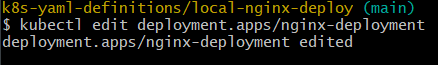

- [Running Kubernetes](#running-kubernetes)
- [Deploy NGINX - 3 pods](#deploy-nginx---3-pods)
  - [Service - to connect the deployment to the "outside world" through a port](#service---to-connect-the-deployment-to-the-outside-world-through-a-port)
  - [What happens if we delete a pod?](#what-happens-if-we-delete-a-pod)
  - [Directly edit a deployment live](#directly-edit-a-deployment-live)
    - [Method 1 - Edit notepad](#method-1---edit-notepad)
    - [Method 2 - Edit and apply deployment file](#method-2---edit-and-apply-deployment-file)
    - [Method 3 - Use a command](#method-3---use-a-command)
- [Delete service and deployment](#delete-service-and-deployment)
- [Deploy the Sparta test app - front page](#deploy-the-sparta-test-app---front-page)
- [Deploy the Sparta test app - with db](#deploy-the-sparta-test-app---with-db)
- [Verify deployment](#verify-deployment)


# Running Kubernetes
1. go to docker desktop
2. go to settings 
3. select kubernetes on the side menu
4. enable kubernetes
5. when it is running it should show up at the bottom of the the docker window


1. check on git bash ```kubectl get service```


# Deploy NGINX - 3 pods

1. create a yaml definition file for your deployment
[NGINX-deploy](k8s-yaml-definitions/local-nginx-deploy/nginx-deploy.yml)

2. use the command ```kubectl create -f *name of yaml file*``` to create your deployment. "f" to specify the file
3. ```kubectl get replicasets``` to list the replica sets
4. ```kubectl get pods``` to list the pods
5. ```kubectl get all``` to get all the information


1. to delete a deployment ```kubectl delete *entire name of deployment*``` (eg. deployment.apps/nginx-deployment)

## Service - to connect the deployment to the "outside world" through a port

1. use a node port service - ports ranging NodePort service can use 30000-32768
2. create a new yaml definition file for the service

[NGINX-service](k8s-yaml-definitions/local-nginx-deploy/nginx-service.yml)
 
3. use the command ``` kubectl create -f nginx-service.yml``` to create the service
4. you can check "localhost:30001" and see one of the nodes running nginx
5. when you run a ```kubectl get all`` you can see that the service has been added

## What happens if we delete a pod?
1. use the command ``` kubectl delete *name of pod*```
2. when you run ```kubectl get pods``` the one that was deleted will be replaced


1. ^^ the age of one of the pods is much younger so k8s replaced the one we deleted

## Directly edit a deployment live
### Method 1 - Edit notepad
1. use ```kubectl edit *name of deployment*```
2. it'll open a note pad 


1. if we want to change the replicas for eg. - spec-> replicas -> change to 
2. file -> save -> exit



1. check ```kubectl get all```, there will be 4 replicas


### Method 2 - Edit and apply deployment file
1. nano into the deploy yaml file
2. change the number of replicas
3. if the file has already been created (or even if it doesn't currently exist, it'll also create)```kubectl apply -f nginx-deploy.yml``` to update changes made to the yaml file
4. do a ```kubectl get all``` and there should be 5 pods now


### Method 3 - Use a command
1. ``` kubectl scale --current-replicas=5 --replicas=6 *name of deployment```
   1. specify the current number of replicas
   2. specify the amount you'd like
2. it will message that it has been scaled
3. when you check get all, there should be 6


# Delete service and deployment
1. delete what is defined in our yaml file
2. delete in a logical order- service first ```kubectl delete -f *name of service file ```
3. then use the same cmd but specify the deployment 

# Deploy the Sparta test app - front page
1. Create a repo for the yaml files
2. change the nginx scripts to be for nodejs 
3. include my nodejs sparta web page image
4. for the **deploy file** - defines the desired state of your pods
5. the app db needs to be seeded so the cmd must be added at the end, along with an npm start

```
---
# YAML is case sensitive
# use spaces not a tab
apiVersion: apps/v1 # specify api to use for deployment
kind: Deployment # kind of service/object you want to create
metadata:
  name: spartafrontpage-deployment # name the deployment
spec:
  selector:
    matchLabels:
      app: nodejs  # look for this label/tab to match the k8 service
# create a ReplicaSet with instances/pods
  replicas: 3 # the number of identical pods you want to make
  template: # defines the template for the pods being created
    metadata: 
      labels:
        app: nodejs #label the pods being made, this must stay consistent
    spec: #defines the spec for the pods being made
      containers: # define the containers, including the images used and ports to expose
      - name: nodejs
        image: nao55/sparta-app-npm-run:latest # the image you create
        ports:
        - containerPort: 3000
         env: # sets env. var. to the mongodb port 3000
        - name: DB_HOST
          value: "mongodb://mongodb-svc.default.svc.cluster.local:27017/posts" # refers to the db service yaml file
        command: ["/bin/sh", "-c"] # cmds to use shell "-c" to run the cmd in the args section below
        args: ["node seeds/seed.js && npm start app.js"]
```
7. run a create/apply ```kubectl create -f frontpage-deploy.yml```
8. for the **service yaml file**
```
---
apiVersion: v1 
kind: Service #the object being created is a service
metadata:
  name: nodejs-svc # the name of the service 
  namespace: default
spec:
  ports:
  - nodePort: 30001 #range is 30000-32768
    port: 3000 # the port the service listens to
    targetPort: 3000 # the port that the service forwards traffic to
  selector: # Specifies the label selector to match the pods managed by this service
    app: nodejs
  type: NodePort # The type of service, it is NodePort so it exposes the service on a static port on each node's IP 
```
9. run a create/apply ```kubectl create -f frontpage-service.yml```
10. when you go to "localhost:30001" the front page should be running

# Deploy the Sparta test app - with db

1. Create a separate repo for the mongo db yaml files for deployment and service
2. For the **deploy yaml**, the format is very similar but the image is mongo
```
---
apiVersion: apps/v1 # specify api to use for deployment
kind: Deployment # kind of service/object you want to create
metadata:
  name: mongodb-deployment # name the deployment
spec:
  selector:
    matchLabels:
      app: mongodb  # look for this label/tab to match the k8 service
# create a ReplicaSet with instances/pods
  replicas: 1 # only one replica for the db
  template:
    metadata:
      labels:
        app: mongodb #this references the pods being made
    spec:
      containers:
      - name: mongodb
        image: mongo:7.0.6 # mongo image we want to use 
        ports:
        - containerPort: 27017 # mongo operates on this port

```
3. run a create/apply ```kubectl create -f db-deploy.yml```
3. for the **service**, it is also very similar to the app svc
4. the port should be the port for mongodb 
```
---
apiVersion: v1 
kind: Service
metadata:
  name: mongodb-svc
  namespace: default
spec:
  ports:
  - nodePort: 30002
    port: 27017
    targetPort: 27017
  selector:
    app: mongodb # Label to match service to deployment
  type: NodePort
```
5. run a create/deploy ```kubectl create -f db-service.yml```

# Verify deployment
1. run the ```kubectl get all``` cmd to see all the pods, services, deployments and replicasets.


2. check "localhost:30001" and "localhost:30001/posts" (depending on the ports you choose to expose) and the app and post page should be working